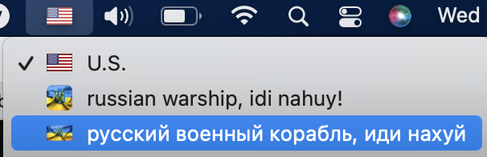

1. Clone this repo
2. Unpack: ```tar xvf russian_warship_idi_nahuy___.bundle.tar.gz```
3. Double Click to install
4. Go to: System preferences -> keyboard -> Input Sources -> + -> In section "Russian" select installed layout...
5. Enjoy!

p.s. reboot can be required before step 4
