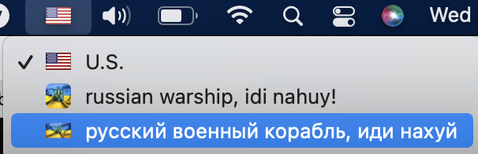

1. Clone this repo
2. Unpack: ```tar xvf bundles.tar.gz```
3. Go to ./bundles Double Click to install (each bundle)
4. Go to: System preferences -> keyboard -> Input Sources -> + -> In section "Russian" select installed layout...
5. Enjoy!

p.s. reboot can be required before step 4
